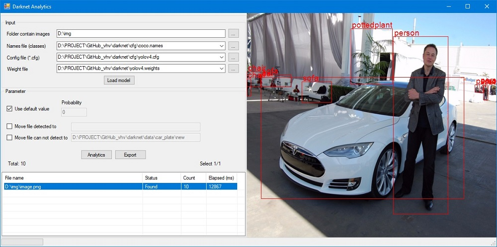

# Darknet Analytics
Xem kết quả YOLO Darknet trực quan bằng Windows Form C#

Lưu ý: đối với chương trình chạy bằng CPU thì việc xử lý rất chậm, do đó chỉ dùng được với các customize model hoặc bản Yolo-tiny.

## Requirement software

- [Visual Studio 2017](https://www.arduino.cc/en/software)

## Test chương trình
Download các file cần thiết:
- [yolov4.cfg (file config)](https://github.com/AlexeyAB/darknet/blob/master/cfg/yolov4.cfg)
- [coco.names (chứa các class name)](https://github.com/AlexeyAB/darknet/blob/master/data/coco.names)
- [Weight](https://github.com/AlexeyAB/darknet/releases/download/darknet_yolo_v3_optimal/yolov4.weights)

Load các file và chọn folder chứa ảnh, sau khi load xong nút Analytics sẽ được enabled. 

Sau khi test xong các bạn double click vào từng dòng để xem kết quả và có thể export ra các file annotation theo format của YOLO Darknet.

